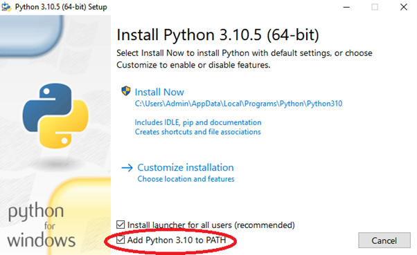
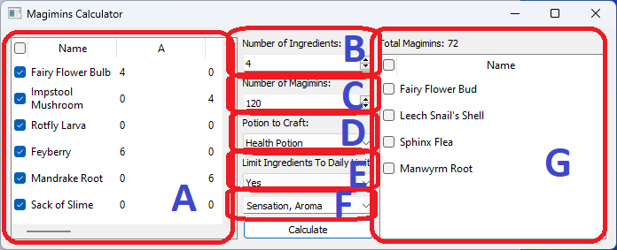

# MagiminsCalculator
A calculator to compute best ingredients combination for the Potionomics game.

# Installation Guide
1. Download Python from https://www.python.org/ftp/python/3.10.5/python-3.10.5-amd64.exe.
2. Run the Python installer file. Make sure to tick the “Add Python 3.10 to PATH” as shown in figure below before selecting “Install Now”. 

  

3. Once finished, run the “Requirements.bat” attached to install the required Python libraries.

# Usage Guide

  

A - Select the ingredients that you already unlocked in the game. 
B - Choose the number of ingredients you want to use for brewing. 
C - Choose the maximum number of magimins that you want for the brew (mostly because of cauldron limit). 
D - Select the potion to brew. 
E - Select whether you want to limit the ingredients to be puchasable in a day (so it won't use rare ingredients too many times). 
F - Select the trait you want in the potion. 
G - The suggested brew.

Note: It currently only compute for perfect brew (doesn't use magimins that are not involved in the potion) and disregard potion traits.
